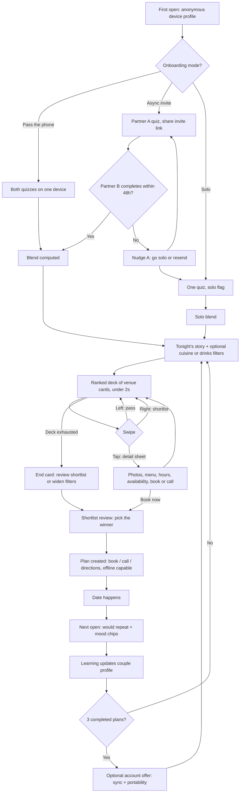

# Where2Eat: Customer Journeys and MVP Scenario Catalog

Companion to [the PRD](../W2E_PRD_Hartford_Prototype.md) (v2.3).
Defines the journey stages, the probable scenarios the MVP must handle, spec gaps found in the PRD (with proposed resolutions), and the scope lines.

**Revision note (v2):** this version reflects three PM decisions, since folded into PRD v2.2: (1) Android app distributed by sideloaded APK for alpha testing, web deferred; (2) scope limited to restaurants and bars, multi-act narrative itineraries deferred; (3) core UX is a swipe deck (Tinder/Hinge-style cards) with photo-forward venue cards, fit scores, menu access, and cuisine/drinks filters, under a minimalist low-cognitive-load design goal.

**MVP definition used throughout:** Phase 0 closed alpha through Phase 1. Android app (Expo/React Native), sideloaded APK, 25 then 100 curated venues (restaurants and bars), swipe-deck UX. Launch/deployment strategy deliberately deferred until the alpha experience is satisfactory.

**v3 addendum:** group swipe matching is now in MVP (PRD v2.3): account holders can run a match session with their partner or friends, rosters of 2 to 10, everyone swiping the same deck, unanimous right-swipes surfacing as a match with a ranked-overlap leaderboard as the fallback. Accounts (Supabase Auth) move into MVP scope to gate it; the core solo/couple experience stays anonymous.

**v4 addendum:** map/Explore mode and live reservation availability move into MVP (PRD v2.4). The map is a toggle view over exactly the deck's candidate pool, never a second engine. Live availability ships as demand-driven partner polling through the D4 provider abstraction, with one honest dependency: partner API access is granted by OpenTable/Resy/etc., not by us. Applications go out at milestone 1; the software is partner-ready either way, and manual + pattern tiers carry the alpha until access lands.

**v5 addendum:** matching goes fully async (PRD v2.5): the lobby/roster-lock model is replaced by a host-set close time. Everyone swipes on their own schedule before the deadline; results at close are a leaderboard with unanimous picks highlighted; late joiners' vetoes shrink the deck without reshuffling it. Live mid-session match popups are gone.

**v6 addendum:** availability simplified to three verified states (PRD v2.6): Closed (posted schedule, daily refresh), Open with walk-in/call guidance, and Open with reservations available (live partner check on the user's behalf). Pattern guesses, stale-claim messaging, manual overrides, feedback-driven signals, availability-based ranking, and automated swaps are all removed. S20 and S22 retired.

---

## 1. Journey map

Seven stages. Every scenario below hangs off one of these.

| # | Stage | What happens |
|---|-------|--------------|
| 0 | First open | Anonymous by default. Local device profile created. No paywall, no signup wall. |
| 1 | Onboarding | 5-question quiz plus a hard-requirements step, via one of three pairing modes (pass-the-phone, async invite, solo). |
| 2 | Blend | Vetoes unioned, soft preferences blended or rotated, summary + compatibility score shown. |
| 3 | Browse the deck | User picks tonight's story (energy state) and optional filters (cuisine, drinks). A ranked deck of venue cards comes back in under 2s. Swipe left = pass, right = shortlist, tap = detail (photos, menu, hours, booking). A map toggle (Explore) shows the same candidates spatially. |
| 3b | Group match (opt-in, account-gated) | Host frames the night, invites partner or friends (2 to 10), and sets a close time. Everyone swipes the same deck on their own schedule; at the deadline the leaderboard ranks the overlap (unanimous picks highlighted) and the host locks the pick into the plan. |
| 4 | Shortlist and decide | Review shortlisted cards side by side, pick the winner (or dinner + drinks pair). Booking actions per availability state. Plan saved for offline. |
| 5 | The date | Saved plan works offline. tel:, maps, and menu links function without our backend. |
| 6 | Afterward | Next-open feedback (would repeat + mood chips). Swipes and feedback feed learning. After 3 completed plans, optional account offer. |

---

## 2. Scenario catalog

Numbered so we can reference them in the technical design and test plan. "Required MVP behavior" is the acceptance bar. IDs are stable across doc revisions: S13..S26 were adapted from the itinerary-era design; S24 is deferred (its ID is not reused); S35..S40 are new with the swipe UX.

### Stage 1: Onboarding and pairing

| ID | Scenario | Required MVP behavior |
|----|----------|----------------------|
| S1 | Pass-the-phone happy path | Both partners answer back-to-back on one device. Blend computed immediately, no network round trip needed beyond quiz submit. |
| S2 | Async invite happy path | A completes quiz, shares link (device share sheet). B opens on their own device, completes quiz. Blend computed on B's submit; B sees it immediately, A sees a "blend ready" banner on next open. B without the app installed hits a lightweight web quiz page (invite links must not require a sideloaded APK to answer). |
| S3 | Async invite stalls | 48h after send with no acceptance: invite marked expired, A prompted in-app on next open to go solo or resend (resend issues a new token, old one invalidated). |
| S4 | Invite token misuse | Token is single-use and expires at 48h. Second open of a used token shows a friendly "already paired" screen. Expired token offers to request a fresh invite. |
| S5 | Solo mode | One quiz, plans flagged "solo-planned". Full functionality otherwise. |
| S6 | Solo, partner joins later | Absent partner completes the quiz later (via invite from the solo user). Blend recomputes, solo flag drops, user notified on next open (PRD 2.3). |
| S7 | Returning anonymous user | Same device: profile and history load locally, no re-quiz. Straight to Stage 3. |
| S8 | Quiz retake / preference edit | Either partner can retake or edit answers at any time. Blend recomputes, rotation state preserved. |

### Stage 2: Blend computation

| ID | Scenario | Required MVP behavior |
|----|----------|----------------------|
| S9 | Aligned couple | Overlapping answers produce a clean blend, high compatibility score, short summary. |
| S10 | Divergent energy archetypes | Third-way lookup (5x5 archetype matrix) surfaces 1 or 2 blend zones, e.g. romantic + social = "intimate booth in a lively room". |
| S11 | Disjoint neighborhoods or structure | Rotation with visible primacy: "tonight leans toward Sam's pick" influences deck ranking, shown openly. |
| S12 | Heavy vetoes, thin candidate pool | Vetoes (dietary union, accessibility union, min budget cap) are hard filters and are NEVER relaxed, including by user-applied cuisine/drinks filters. If the deck falls under a handful of cards, offer soft relaxations (radius expand, widen neighborhoods) with honest messaging. If still empty, say so plainly and show the closest misses with what blocked them. |

### Stage 3: Browse the deck

| ID | Scenario | Required MVP behavior |
|----|----------|----------------------|
| S13 | Standard deck generation | Story + optional filters in, ranked deck (up to ~30 cards) out, p95 under 2s. Deterministic per session (seeded): everyone browsing the same session sees the same deck in the same order. |
| S14 | Thin inventory night | Sunday/Monday/holiday in Hartford: fewer venues open. Small deck shown with an honest count ("7 places open tonight that fit"), plus the widen prompt. Never pad with venues that violate the blend. |
| S15 | Bad weather | Rain or nor'easter: patio-dependent venues down-ranked or badged, weather-variant card blurbs used, snow-day bias toward shorter drives. |
| S16 | Event night | Bushnell show / Wolf Pack / UConn game night (manual event flags in MVP): downtown cards carry a parking-pressure warning and pre-show timing note. |
| S17 | Repeat user novelty | Venues passed recently are down-ranked for a while; the venue from the last completed plan is excluded unless the archetype is "low-key & familiar" or feedback said "would repeat". Familiarity seekers get deliberate resurfacing of loved spots. |
| S18 | Party size above 2 | Passed through to the plan and booking action. No group-blend logic in MVP (blend stays the couple's). |
| S35 | Swipe mechanics | Left = pass, right = shortlist, tap = detail sheet. Undo button reverses the last swipe (fat thumbs are real). On-screen pass/save buttons mirror the gestures at all times: gesture-only UI fails screen-reader users and WCAG (PRD section 9 gate). Haptic tick on each decision. |
| S36 | Filters | Chip row: cuisine categories + a "drinks" chip (bars/cocktail spots). Filters are session-scoped, stack with the blend (filters narrow, never override vetoes), and visibly show active state. Clearing filters restores the full deck without regenerating. |
| S37 | Deck exhaustion | Swiped through everything: end card summarizes ("You passed on 18, shortlisted 3"), offers shortlist review, filter widening, or radius expansion. Never an infinite feed of junk; scarcity is honest here. |
| S39 | Menu access | One tap from card detail opens the venue's curated menu URL in an in-app browser. Venues without a stable menu URL fall back to website, then tel:. Menu coverage is a curation requirement for the top 100. |
| S40 | Photos | 3 to 5 photos per venue, full-bleed on cards. Next 3 cards' images prefetched so swiping never shows a spinner. Blurhash placeholder on slow connections. Source attribution rendered where licensing requires it. |
| S49 | Explore map toggle (v4) | One tap flips deck to a full-screen map. Pins are exactly the current deck's pool: same vetoes, same filters, same story; the map NEVER shows a venue the deck wouldn't. Tap a pin for its card in a bottom carousel; carousel swipes pan the map. Pass/shortlist work from the map card too and count as normal swipes. Tap-through to the same detail sheet. |
| S50 | Map without location (v4) | Location permission stays optional: without it the map centers on Hartford with neighborhood context; with it, a user dot appears and distance lines use the real position (still computed on-device, never sent to the server). Map layers beyond pins (routes, heatmaps, weather) remain Phase 2. |

### Stage 3b: Group match (account-gated, added v3)

Flow diagram lives in technical-design.md section 6.5. Matching never replaces the solo/couple deck; it is an opt-in layer on top of it. Fully async as of v5: no lobby, no simultaneity assumption; a host-set close time bounds every session.

| ID | Scenario | Required MVP behavior |
|----|----------|----------------------|
| S41 | Create a match session | Host (account required) picks people from their friends list or generates a session join link, sets the area, tonight's story, the planned night, and a close time (presets: 1h / 3h / this evening / 24h). The deck generates immediately from the host's frame plus invited participants' vetoes; swiping starts right away for anyone who's in. Rosters of 2 to 10; swipes accepted only from participants while the session is open. |
| S42 | Join a session | Deep link opens the app straight into the session, any time before the deadline (sign-in first if needed). A friend without an account signs up first; without the quiz done, they complete it before swiping (their vetoes are needed). Without the app, the web landing page explains the alpha honestly (APK from the host) rather than dead-ending. |
| S43 | Group deck | One deck, same order for everyone (session seed), generated at creation from the host's frame + invited participants' vetoes (lowest budget ceiling wins). A link-joiner's vetoes disqualify venues for everyone: the deck shrinks monotonically, never reorders or grows, and a venue violating ANY participant's vetoes cannot win even if it collected rights before they joined (those swipes are discarded, and the results view says so). Personal learning weights are NOT applied in group decks (fair and explainable). |
| S44 | Results at close | At the deadline or host early-close, the session locks and results materialize: venues ranked by right-swipe count, blend fit as tie-break, unanimous picks (right-swiped by every actual swiper) highlighted at the top ("everyone said yes"). Participation shown honestly ("4 of 6 swiped"); non-swipers never count against a venue, and their vetoes still protect them. Results surface via next-open banner; the host shares the moment in the group's own text thread. |
| S45 | Deadline mechanics | While open, the session screen shows live progress ("4 of 6 have swiped", polled ~7s). Close is evaluated on read, so results are exact to the minute without waiting on a cron. The host can close early once enough votes are in; swipes and undos are accepted freely until close and rejected after. Sessions with no locked pick expire after the planned night. |
| S46 | Group veto pileup | S12 at scale: 8 people's dietary unions + the lowest budget ceiling can gut the deck. Honest count up front ("5 places work for all 8 of you"); relaxation offers touch only the host's area/radius. Vetoes never relax, not even one person's. |
| S47 | Friends management | Add a friend via share link only (same pattern as partner invites): no username search, no contact upload, no suggestions. List and remove friends; block prevents rejoining your sessions and re-adding. |
| S48 | The account gate | Tapping "Match with friends" from an anonymous state routes through account creation (Supabase Auth) with the existing local history migrating (S31 flow), then straight back into session creation. Both partners need accounts to match as a couple. The core solo/couple deck never requires an account. |

### Stage 4: Shortlist, decide, book

| ID | Scenario | Required MVP behavior |
|----|----------|----------------------|
| S38 | Shortlist review and decide | Shortlisted cards in a compact compare view (photo, fit, rating, price, distance, tier). Picking one (or a dinner + drinks pair) creates the plan. Shortlist persists for the session and syncs to the couple so either partner can look. |
| S19 | Open with reservations | A reservation check fresh within 30 minutes found seats at the user's party size: "Reservations available" badge + one-tap booking, date/time/party prefilled. The only state that makes an availability claim, and only from a live check run on the user's behalf. |
| S20 | ~~Tier B stale cache~~ | Retired in v6: no stale-claim messaging ("last confirmed 23 min ago" is gone). ID not reused. |
| S21 | Open, walk-in or call | Open per posted schedule but no verified seats (walk-in venue, none left, no partner access, or check failed): "Open · try walking in or call the restaurant." No pattern guesses, ever. A venue with a reservation platform keeps its link in the detail sheet, without a claim. |
| S22 | ~~Tier D swap~~ | Retired in v6 with the tier model: no availability-based down-ranking, no automated swap suggestions. ID not reused. |
| S23 | Reservation check outage | If partner checks fail or access is missing, open venues simply show walk-in/call guidance. The deck is never blocked, nothing unverified is claimed, and the phone number is the floor. |
| S51 | Demand-driven reservation checks (v4) | Deck generation and detail-sheet opens enqueue background seat checks for surfaced venues whose latest check is stale (>5 min); the UI renders instantly from cache and the reservations badge appears in place when fresh data lands. No screen ever waits on a partner API. |
| S52 | Live booking handoff (v4) | With verified seats (S19), the book button deep-links out with date, time, and party size prefilled. We log the outbound tap as activation; we do not (and cannot) verify booking completion in MVP. |
| S24 | ~~Mixed availability across acts~~ | Deferred with multi-act itineraries. ID retired, not reused. |

### Stage 5: During the date

| ID | Scenario | Required MVP behavior |
|----|----------|----------------------|
| S25 | Plan offline | Saved plans cached on device (including card images already in the image cache). Full plan readable with no connection. tel:, maps, and menu links work natively or degrade gracefully. |
| S26 | Generation-time API outage | Venue data, fragments, and photo URIs are all in our own DB, so deck generation works even if every external API is down. Photos degrade to cached copies; weather note degrades to seasonal default. |

### Stage 6: Feedback, learning, accounts

| ID | Scenario | Required MVP behavior |
|----|----------|----------------------|
| S27 | Feedback prompt | Next open on or after the morning after the planned date: "Would repeat?" + mood descriptor chips. One tap to dismiss, never nags twice for the same plan. |
| S28 | Feedback skipped | Plan marked completed-unconfirmed. Still counts toward the account-offer counter. No learning update from feedback (swipe signals still count). |
| S29 | Learning applied | Explicit feedback is the strongest signal: would-repeat = yes boosts that venue and its attributes for this couple. Swipes are weak signals: rights nudge attribute affinities up, lefts nudge down, with small weights (a pass can mean "ate there yesterday", not "hate it"). Next session visibly reflects it ("because you loved X"). Deterministic rules, no ML in MVP. |
| S30 | Account offer at 3 completions | Optional, dismissible, additive (sync + portability pitch). Declining changes nothing (PRD: guest mode is full functionality). Group matching is the second, stronger account trigger (S48). |
| S31 | Account created | Local profile, quizzes, couple link, history migrate to the account. Second device signs in and syncs. |
| S32 | Cleared storage / new device, no account | Cold start with honest messaging: "no account means this device starts fresh". This IS the sync value prop; never guilt-trip. |
| S33 | Data export / delete | Export preference data + history as JSON. Delete wipes server-side anonymous records and instructs on clearing local data. GDPR-style even for US users. For account holders, export and delete cover friends list, sessions, swipes, and display name too. |
| S34 | Content flag | Any venue description, photo, or fragment can be flagged; flags queue for admin review (PRD community moderation). |

---

## 3. Spec gaps and PRD deviations, with resolutions

Items 1 to 6 are ambiguities found in the PRD. Items 7 to 10 were deliberate deviations introduced by the v2 pivot, folded into PRD v2.2.

1. **Vetoes are not in the 5-question quiz.** The quiz (PRD 1.1) covers neighborhood, energy, radius, budget comfort, structure. But the blend's hard vetoes (PRD 2.1) need dietary restrictions, accessibility needs, and an absolute budget ceiling. Resolution: onboarding = 5 personality questions + a separate "hard requirements" step. Also keeps "budget comfort zone" (soft, blendable) distinct from "absolute ceiling" (veto), which the PRD itself distinguishes.
2. **Who sends the invite?** PRD says "shares an invite link via SMS or email". Resolution: the user sends it themselves via the device share sheet. No SMS provider, no email infrastructure, no partner PII collected. The 48h nudge is in-app on A's next open (we have no channel to reach an anonymous A anyway).
3. **"Completed plan" is undefined** but drives the account offer (3 completions) and the feedback prompt. Resolution: saved plan whose planned date has passed = presumed completed. Feedback response upgrades it to confirmed. Presumed counts toward the account-offer counter.
4. **Rotation advance trigger is undefined.** Resolution: rotation primacy advances only when a session produces a plan or an outbound booking action, not on browsing or swiping alone. Browsing shouldn't burn a partner's turn.
5. **Device fingerprinting (PRD Data Governance) conflicts with the privacy stance.** Resolution: drop it. The anonymous profile UUID already provides continuity without fingerprinting's privacy smell.
6. **Anonymous-but-paired tension.** PRD says anonymous preferences live on-device, but async invite and solo-partner-joins-later require both quizzes server-side to compute the blend. Resolution: minimal anonymous server record (opaque UUID + quiz answers + couple link, zero PII, deletable via S33). History and saved plans stay local-first with a server copy for couple sync.
7. **Platform (PRD says web-first).** v2 decision: Android app (Expo/React Native), sideloaded APK for alpha; the only web surfaces are the admin tool and the invite-landing quiz page (S2). iOS and public web deferred to the launch-strategy conversation.
8. **Core experience (PRD section 3 says 3 to 5 narrative itineraries).** v2 decision: swipe deck of individual venue cards. Pre-authored narrative fragments survive as card blurbs; multi-act assembly is deferred (see scope cuts). PRD section 3 was rewritten in v2.2.
9. **Evening structure question (quiz Q5).** With restaurants + bars only, the PRD's options (dinner + live music / + show / + late-night) can't be honored. Resolution: Q5 narrows to dinner only / dinner then drinks / drinks then dinner / just drinks. Original options return with Phase 3 orchestration.
10. **Scores on cards.** "Most accurate score" = two numbers max per card for cognitive load: the Google+Yelp count-weighted rating and a blend-fit percentage (from deck scoring). Couple compatibility score stays on the blend screen only.
11. **Accounts (PRD 1.3 said "never required").** v3: still true for the core solo/couple experience. Group matching is account-gated because friends lists, display names, and cross-device sessions cannot hang off an anonymous device UUID. Framed as additive social value, consistent with the PRD's value-exchange stance; folded into PRD v2.3. Consequence: accounts (Supabase Auth) move from Phase 1 into MVP build scope.

---

## 4. MVP scope cuts (explicit)

In the PRD but deliberately deferred, so the build doesn't sprawl:

- **Multi-act narrative itineraries**: the founding concept, deferred by the v2 pivot to lock the swipe UI first. Fragments, blend, and scoring all survive and feed the deck; act-chaining logic and venue-to-venue distances are parked (essence preserved in the technical design appendix).
- **Map layers beyond pins** (route optimization, event-density heatmap, weather overlay): Phase 2. The MVP map (v4, S49) is pins + carousel over the deck pool, nothing else.
- **Booking completion tracking**: we hand off to partner booking flows with prefilled deep links (S52) and log the outbound tap; verifying that a reservation was actually completed requires partner-side integration that stays out of MVP.
- **Availability guesses (v6)**: no pattern-inferred claims, no stale-cache claims, no manual availability entry, no feedback-driven availability signals. We assert only what the daily schedule refresh and a live reservation check can verify; everything else is "try walking in or call".
- **Event API integrations** (Ticketmaster/AXS): manual event-flag table in MVP, admin-entered for Bushnell/PeoplesBank/Trinity Health dates.
- **iOS, public web app, Play Store listing, SMS**: all deferred to the launch-strategy conversation.
- **Push notifications**: still deferred, but now the top fast-follow. Async sessions surface progress and results via in-app polling and next-open banners; push is what would carry deadline reminders and results announcements to closed apps. Until then, the host's group text does that job.
- **Group chat / messaging**: never in the prototype. The session link rides the group's existing text thread; the app's job is the decision, not the conversation. Zero free-text between users also keeps the moderation surface near zero.
- **Friend search and discovery**: add-via-link only. No usernames to search, no contact upload, no "people you may know". (Swipe matching itself moved INTO MVP in v3; see Stage 3b.)
- **ML-based learning**: deterministic scoring boosts only. Revisit when there's enough swipe + feedback data to matter.
- **Review sentiment analysis (Tier 2)**: Google + Yelp rating/review-count snapshots at curation time are enough for 100 hand-picked venues. TripAdvisor stays out.
