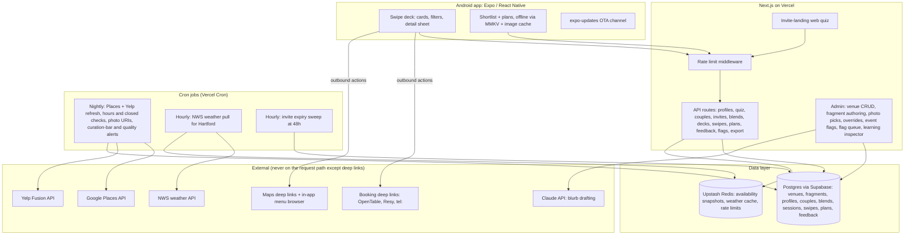
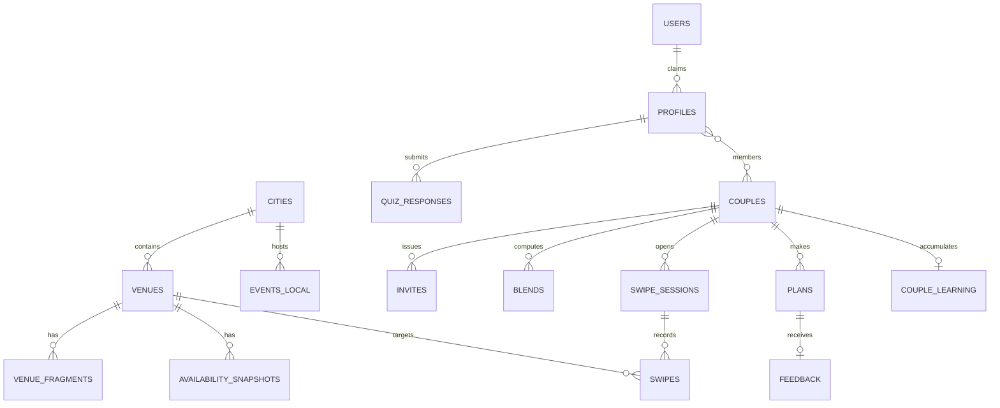
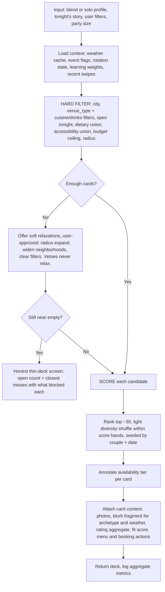
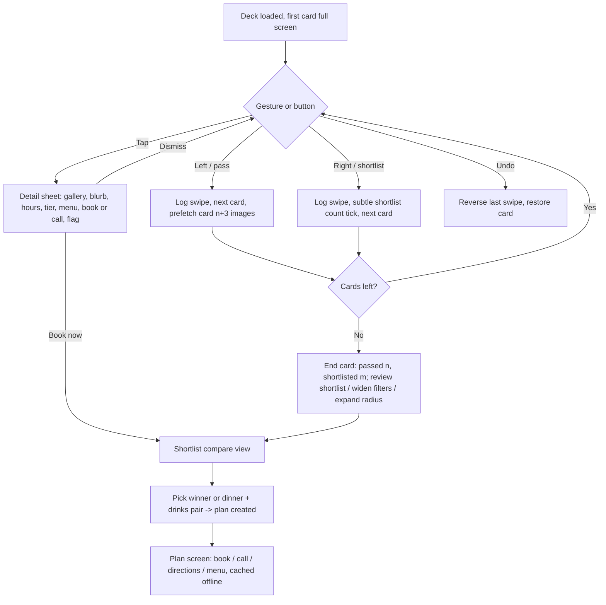
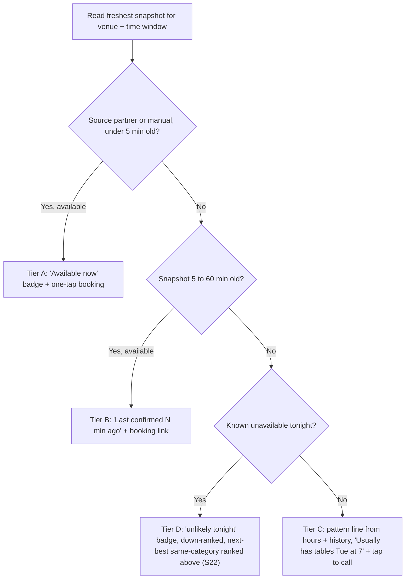

# Where2Eat: Technical Design (MVP)

Covers Phase 0 alpha through Phase 1 of [the PRD](../W2E_PRD_Hartford_Prototype_v2.1_1.md), as amended by the v2 pivot (Android APK alpha, restaurants + bars only, swipe-deck UX, minimalist design).
Scenario IDs (S1..S40) reference [customer-journeys.md](customer-journeys.md). Decision IDs (D1..D8) are stable across revisions.

---

## 1. Design goals, ranked

1. **The swipe must feel native.** 60fps gesture physics, zero-spinner photo loads. This is now the product bet; everything else bends to it.
2. **p95 under 2s for deck generation.** Everything on the hot path is precomputed or in our own database.
3. **Low cognitive load.** One decision per screen, progressive disclosure, two numbers max per card. Minimalism is a release gate, not a vibe.
4. **Honest degradation.** No external API failure ever blocks the deck (S23, S26). The floor is always a phone number.
5. **Anonymous-first with real pairing.** No account needed; async invites still work across devices (S2).
6. **One developer can build and run it.** Managed services, no ops burden, sideload-friendly builds.
7. **Multi-city ready, single-city built.** `city_id` on every content table; zero other speculative generality (YAGNI).

## 2. Key architecture decisions

Short ADR format: decision, why, alternative rejected. Revision status marked per decision.

### D1. Card copy is pre-authored, not generated at request time (unchanged, repurposed)

- **Decision:** Each venue carries editorially approved fragments per energy archetype ("why this place tonight" blurbs, with optional season/weather variants). Deck generation is deterministic assembly: filter, score, rank, attach the matching fragment and photos to each card.
- **Why:** With 25 to 100 curated venues, authoring is tractable (Claude drafts in the admin tool, editor approves). Buys: p95 well under 2s (no LLM on the hot path), zero per-request inference cost, editorial voice control, offline-friendly output, deterministic same-night decks so both partners see the same order (S13, and the future couple-match feature depends on it).
- **Rejected:** Per-request LLM generation. Latency and cost fight the 2s p95; request-time quality control contradicts the curated positioning.
- **v2 note:** title seeds and opening lines (for 3-act stories) are no longer authored in MVP; only `why_tonight` blurbs. Multi-act rendering is deferred (Appendix A).

### D2. Expo (React Native) client + Next.js API/admin (revised in v2)

- **Decision:** The user-facing client is an Expo (React Native, TypeScript) Android app. The Next.js app survives as the API layer and the web admin/curation tool, plus one public web page: the invite-landing quiz (S2). Shared zod schemas/types live in a shared workspace package.
- **Why:** The swipe deck is the product. WebView wrappers (Capacitor, TWA) render gestures through the browser engine and get janky on mid-range Androids, exactly where a Tinder-feel dies. React Native drives native views with gesture handling on the UI thread (`react-native-gesture-handler` + `reanimated`), which is how the apps we're imitating actually feel. Expo makes APK builds and OTA updates one-command. React + TypeScript skills carry over from the web stack.
- **Rejected:** Capacitor (one codebase, but compromises the core interaction), Flutter (new language for no gain here), pure native Kotlin (kills iOS reuse later and slows a one-dev team).
- **Cost accepted:** two build targets (mobile client + web admin) in one monorepo.

### D3. Minimal anonymous server profile (unchanged)

- **Decision:** An opaque UUID profile row is created server-side on first quiz submit. It holds quiz answers, veto answers, and couple membership. No name, email, phone, or location. Plans and history live on-device with a server copy for couple sync; the server keeps only what pairing, blending, and sync require. Account creation (S31) later attaches Supabase Auth to the same profile.
- **Why:** Async invite (S2) and solo-partner-joins-later (S6) are impossible with purely on-device data. Smallest server footprint that makes pairing work; satisfies storage minimization and deletability (S33).

### D4. Availability is a provider abstraction with tiers computed at read time (unchanged)

- **Decision:** An `AvailabilityProvider` interface with pluggable sources: `ManualOverride` (alpha), `PatternProvider` (curated hours + day-of-week heuristics), later `PartnerProvider` (OpenTable/Resy if a partnership lands). Snapshots land in Redis and Postgres; the tier (A/B/C/D) is derived from snapshot freshness and source at read time (PRD 4.1). Tiers render as card badges and drive the primary action (book vs call).
- **Why:** No prototype gets OpenTable/Resy availability APIs. Ships the full tier UX now, running mostly on Tier C, and slots partner APIs in later without touching the UI. Scraping rejected: ToS risk for a partnership-dependent product.

### D5. Venue-to-venue distances (deferred in v2)

- Was: precompute drive/walk times between venues for act chaining. Deferred with multi-act itineraries (Appendix A). Distance shown on cards is user-to-venue, computed client-side from device location (if granted) or neighborhood centroid, never sent to the server.

### D6. Deterministic learning, no ML (unchanged, extended)

- **Decision:** Explicit feedback (S27) writes strong boosts; swipes write weak ones (S29). Right swipe nudges the venue's attribute tags up for the couple, left nudges down, small weights, feedback dominates. All weights visible in the admin tool.
- **Why:** At 5 to 100 couples there is no training data. Rules are debuggable and explainable ("because you loved X"). Swipes give the learning loop volume that feedback alone never had.

### D7. Sideloaded APK with OTA updates (new in v2)

- **Decision:** Alpha distribution is a signed APK, sideloaded (no Play Store). Built via EAS Build (`preview` profile produces an installable APK) or locally via `expo prebuild` + Gradle. JS-level changes ship over the air with `expo-updates`, so testers reinstall the APK only when native dependencies change.
- **Why:** Matches the stated plan (sideload now, launch strategy later). OTA turns the alpha iteration loop from "re-send an APK and re-install" into "restart the app", which matters when the testers are James and spouse on date night.
- **Details:** signing keystore generated once, stored outside git (`*.jks` gitignored per house rules); testers enable "install unknown apps" once; distribution via EAS internal-distribution link or direct file share.

### D8. The deck replaces itinerary assembly as the core engine output (new in v2)

- **Decision:** `generateDeck(blend, story, filters, context)` returns up to ~30 ranked venue cards. The old pipeline survives intact up through scoring; what changed is the output shape (ranked cards, not assembled 3-act stories) and one new input (user filters, S36).
- **Why:** Locks the UI the PM wants to validate while preserving the engine investment. When multi-act itineraries return, they compose on top of the same filter/score core.

## 3. Stack

| Layer | Choice | Why it fits |
|-------|--------|-------------|
| Mobile client | Expo (React Native, TypeScript), expo-router | Native gesture feel (design goal 1), one-command APK, OTA updates, React skills carry over. |
| Swipe deck | react-native-gesture-handler + react-native-reanimated | Gestures and spring physics run on the UI thread, not the JS thread: this is the 60fps difference. |
| Images | expo-image | Built-in disk/memory cache, prefetch API (next 3 cards), blurhash placeholders (S40). |
| Mobile styling | NativeWind (Tailwind syntax for RN) + custom design tokens | Keeps the Tailwind mental model across web admin and app; tokens enforce the minimalist system (section 9). |
| Local storage | MMKV (key-value) + expo-image cache | Profile pointer, saved plans, shortlist, offline cache (S25). MMKV is the fast RN-standard store. |
| API + admin | Next.js 15+ (App Router, TypeScript) on Vercel | API routes for the app, web admin for curation, invite-landing quiz page (S2). |
| Database | Postgres (Supabase) | Relational fits the model; Supabase bundles auth (Phase 1 accounts) and storage. |
| ORM | Drizzle | Type-safe schema in TypeScript; schemas shared with the client via the monorepo package. |
| Cache / rate limit | Upstash Redis + @upstash/ratelimit | Availability snapshots, weather cache, day-one rate limiting (PRD requirement). |
| Weather | NWS API (api.weather.gov) | Free, no key, US government, hourly forecast for the Hartford grid. Open-Meteo fallback. |
| Venue data | Google Places API, curation-time only | Enrichment on ingest + nightly hours/closed/photo-URI refresh. Never called on the request path. |
| Ratings | Yelp Fusion API, curation-time only | Second rating source for the Google+Yelp aggregate and the automated curation-bar check (open question 7). |
| Content authoring | Claude API (batch, in the admin tool) | Drafts card blurbs per venue x archetype from venue facts + voice guide; editor approves before publish. |
| Analytics | Server-side aggregate counters (`metrics_daily`) | Aggregate-only, no individual tracking, no third-party SDK in the app. |
| Testing | Vitest (engine), Maestro (mobile e2e), Playwright (admin e2e), manual TalkBack pass | Blend + deck engines are table-driven-test targets; a11y is a release gate. |

Dropped from v1: Serwist/PWA (replaced by the native app), Radix (web-only; admin can keep it), Plausible (web analytics; the app reports to our own counters).

## 4. System architecture



Key property preserved from v1: the request path (quiz, blend, deck, swipes, plans, feedback) touches only Postgres and Redis. External APIs feed the data layer via jobs; booking, maps, and menus are client-side deep links out. That is what makes S26 (full external outage, deck still generates) true by construction. Card photos are the one nuance: the client loads them from the source CDNs (Google/Yelp) with on-device caching, so a photo-CDN outage degrades to cached images, never a blocked deck.

## 5. Data model



Tables and load-bearing columns (Drizzle schema will be the source of truth; this is the design intent):

- **cities**: `id, slug, name, timezone, active`.
- **venues**: `id, city_id, venue_type (restaurant|bar|hybrid), name, slug, neighborhood, lat, lng, price_tier (1..4), cuisines[], drink_tags[] (cocktails|wine|beer|dive|rooftop), phone, website, menu_url, booking_platform, booking_url, hours (jsonb), parking_notes, dress_code, has_patio, noise_level, lighting, wheelchair_access, accessible_restroom, dietary_flags (jsonb: vegan, vegetarian, gluten_free, halal, kosher), google_place_id, yelp_business_id, ratings (jsonb: per-source rating, review_count, observed_at), rating_aggregate, photos (jsonb: ordered URIs, source, attribution, blurhash), editorial_sources (jsonb), signature_dishes[], authenticity_note, curation_tier (1..4), status (draft|active|closed|flagged)`. `venue_type` + `drink_tags` power the drinks filter (S36); `menu_url` is a curation requirement (S39); `photos` are admin-picked, 3 to 5 per venue, URIs refreshed by J1 (S40). `yelp_business_id` resolved once via Yelp business-match; `rating_aggregate` is the review-count-weighted Google+Yelp average; J1 alerts when a venue drops below the curation bar (4.3 aggregate, 200+ combined reviews).
- **venue_fragments**: `id, venue_id, archetype (5 base + blend zones), kind (why_tonight), season_tag, weather_tag, text, status (draft|approved), author`. Card engine only reads `approved`. (Title/opening kinds return with multi-act, Appendix A.)
- **profiles**: `id (uuid), created_at, last_seen_at`. Deliberately nothing else (D3).
- **quiz_responses**: `id, profile_id, version, personality (jsonb: neighborhood, archetype, radius, budget_comfort, structure), vetoes (jsonb: dietary[], accessibility[], budget_ceiling), submitted_at`. Versioned (S8); Q5 structure options narrowed per journeys gap 9.
- **couples**: `id, profile_a_id, profile_b_id (nullable), mode (pass_phone|async|solo), created_at`.
- **invites**: `id, couple_id, token (unique), status (pending|accepted|expired|revoked), expires_at, created_at`. 48h expiry via J3 (S3, S4).
- **blends**: `id, couple_id, version, vetoes (jsonb), soft (jsonb), rotation (jsonb: next_primacy), score (0..100), summary, computed_at`. Append-only for auditability.
- **swipe_sessions**: `id, couple_id, city_id, story_input (jsonb: archetype, filters, party_size), seed, created_at`. The seed makes the deck deterministic and replayable (S13).
- **swipes**: `id, session_id, venue_id, direction (left|right|undo), position, created_at`. First-party product data: powers dedupe (S17), learning (S29), and the future couple-match. No dwell-time or other surveillance-shaped fields.
- **plans**: `id, couple_id, venue_ids[] (one, or dinner + drinks pair), planned_for (date), party_size, solo_planned (bool), status (saved|completed_presumed|completed_confirmed|abandoned), snapshot (jsonb: rendered cards at save time), created_at`. The snapshot keeps a saved plan immutable even if venue data changes later (S25).
- **feedback**: `id, plan_id, would_repeat (bool, nullable), moods[], created_at` (S27).
- **couple_learning**: `couple_id, venue_boosts (jsonb), attribute_affinities (jsonb), updated_at` (D6).
- **availability_snapshots**: `id, venue_id, source (partner|manual|pattern), status, slot_at, party_size, observed_at`. Redis hot copy, Postgres history.
- **events_local**: `id, city_id, date, name, area (bushnell|peoplesbank|trinity_health|other), start_time, expected_impact` (S16).
- **content_flags**: `id, subject_type, subject_id, reason, status, created_at` (S34).
- **users** (Phase 1+): Supabase auth row; `profiles.user_id` nullable FK when accounts land (S31).
- **metrics_daily**: `date, metric, value`. Aggregate-only counters.

Dropped from v1: `itineraries`, `itinerary_acts`, `venue_distances` (deferred with multi-act, Appendix A).

## 6. Core flows

### 6.1 Async invite pairing (S2, S3, S4, S6): unchanged from v1

```mermaid
sequenceDiagram
    participant A as Partner A (app)
    participant API as API
    participant DB as Postgres
    participant B as Partner B (web quiz page)

    A->>API: POST /quiz (answers + vetoes)
    API->>DB: create profile A, quiz_response
    A->>API: POST /couples (mode async) + POST /invites
    API->>DB: couple (B null), invite token, expires 48h
    API-->>A: share URL
    A->>B: shares link via device share sheet (SMS or email, user-sent)
    B->>API: GET /invite/:token
    API-->>B: web quiz UI (no APK required, token validated, single use)
    B->>API: POST /quiz + accept invite
    API->>DB: create profile B, attach to couple, invite accepted
    API->>API: compute blend
    API-->>B: blend summary + score
    Note over A: next open: "blend ready" banner
    Note over API: Cron J3: token past 48h and pending -> expired; A sees solo-or-resend prompt on next open
```

### 6.2 Deck generation pipeline (S12..S18, S36)



Scoring (deterministic, tunable weights in config):

| Component | Range | Notes |
|-----------|-------|-------|
| Archetype fit | 0..40 | Direct match, or third-way blend-zone match (S10) |
| Neighborhood fit | 0..15 | Rotation-aware when disjoint (S11) |
| Price fit vs budget comfort | 0..15 | Comfort zone is soft; the ceiling was already a hard filter |
| Quality | 0..10 | From curation tier + rating_aggregate (Google + Yelp, count-weighted) |
| Context | -10..+10 | Patio boost or suppression by weather (S15), event-night proximity (S16) |
| Learning | -10..+10 | Feedback boosts strong, swipe nudges weak (S29) |
| Novelty | -5..+5 | Recently-passed venues down-ranked; sign flips for "low-key & familiar" (S17) |

The card's displayed **fit score** is the total normalized to a percentage. Tie-breaks and the diversity shuffle use a seed of `couple_id + date`, so both partners see the same deck order all evening (S13), which the future couple-match feature depends on.

### 6.3 Swipe session (S35, S37, S38)



Swipes batch-post to the API (fire-and-forget with local queue) so gesture latency never waits on the network.

### 6.4 Availability tier decision (S19..S23): unchanged from v1



Tier is computed at read time from data freshness, never stored as a fact about the venue. MVP reality: Tier C most of the time, B/A only via manual override (alpha) or a future partner feed.

## 7. Blend engine (PRD 2.1, S9..S12): unchanged from v1

Pure function: `(quizA, quizB | null, rotationState) -> Blend`. The most heavily unit-tested module.

1. **Vetoes:** `dietary = union(A, B)`, `accessibility = union(A, B)`, `budget_ceiling = min(A, B)`. Hard filters only, never scored, never relaxed, and user filters (S36) cannot override them.
2. **Archetype:** equal -> keep. Different -> `THIRD_WAY[a][b]`, a curated 5x5 matrix returning 1 or 2 blend zones. Content deliverable before alpha.
3. **Neighborhood:** intersection if non-empty, else union with rotation primacy deciding tonight's lean, shown openly.
4. **Radius:** `min(A, B)` with an "expand if needed" toggle feeding the relax ladder.
5. **Structure:** narrowed Q5 (dinner only / dinner then drinks / drinks then dinner / just drinks). Disagreement = deck includes both types with the lean shown.
6. **Compatibility score:** weighted overlap (archetype 30, budget 20, neighborhood 20, radius 15, structure 15). Shown on the blend screen only, never on cards.
7. **Solo:** blend = A's profile + `solo` flag; partner-joins-later recomputes (S6).

## 8. Card content

Front of card (the whole interface while swiping):
- Full-bleed photo (first of 3 to 5, admin-picked).
- Name; one metadata line: cuisine or drink tag, neighborhood, price tier, distance from user.
- Two numbers max: rating (Google+Yelp aggregate) and fit %.
- One-line blurb: the `why_tonight` fragment for the blend's archetype (weather/season variant if tagged).
- Tier badge only when it earns attention (available now / unlikely tonight).

Detail sheet (tap): photo gallery, full blurb, hours tonight, availability line, menu button (in-app browser on `menu_url`), book or call, directions, accessibility and dietary icons, flag action.

Authoring workflow: admin picks a venue, hits "Draft with Claude" (venue facts + archetype voice guide in, 3 drafts out), edits, approves. 100 venues x ~5 archetypes is ~500 blurbs; drafting assistance makes this days of editorial work, and it is the Phase 1 content-critical path.

## 9. UI design principles (low cognitive load, glossy)

These are testable rules, not taste. A screen that violates one needs a written reason.

1. One primary decision per screen. The deck asks exactly one question: this place, tonight, yes or no.
2. Max 5 information elements on a card front (photo, name, meta line, scores, blurb). Everything else is progressive disclosure behind the tap.
3. Two numbers max per card. Rating and fit. No review counts, no distances-to-the-decimal, no badge soup.
4. Photography is the interface: full-bleed images, text on a bottom scrim gradient, no chrome while swiping.
5. Dark-first palette (the app is used on evenings out), one accent color, two type scales per screen, 8pt spacing grid.
6. Motion communicates state: spring physics on swipe, haptic tick on decisions, no decorative animation.
7. Gestures always have visible button equivalents (S35). Accessibility is not a mode.
8. Empty and thin states are honest and specific ("7 places open tonight that fit"), never fake-infinite.

## 10. API surface

All routes rate-limited (Upstash sliding window per IP + profile UUID). zod validation at every boundary, schemas shared with the client. No PII in logs.

| Route | Purpose |
|-------|---------|
| `POST /api/profiles` | Create anonymous profile (UUID stored in MMKV client-side) |
| `POST /api/quiz` | Submit quiz + vetoes |
| `POST /api/couples` | Create couple (pass_phone, async, solo) |
| `POST /api/invites` / `GET /api/invites/:token` / `POST /api/invites/:token/accept` | Async pairing lifecycle; GET serves the web quiz page (S2..S4) |
| `POST /api/blends/compute` | Recompute blend (also server-triggered on quiz submit) |
| `POST /api/decks/generate` | The hot path: story + filters in, ranked card deck out |
| `POST /api/swipes` | Batched swipe events (fire-and-forget from client queue) |
| `POST /api/plans` / `GET /api/plans` | Create from shortlist pick; list for couple sync (S38) |
| `POST /api/plans/:id/feedback` | Would-repeat + moods (S27), accepts offline replays |
| `GET /api/venues/:id` | Detail-sheet payload |
| `POST /api/flags` | Content flag (S34) |
| `GET /api/export` / `POST /api/delete` | Data portability + erasure (S33) |
| `/admin/*` | Venue CRUD (incl. photo picks + menu_url), blurb authoring with Claude drafts, availability overrides, event flags, flag queue, learning-weight inspector. Supabase Auth + allowlist. |

## 11. Non-functional requirements

### Interaction performance (design goal 1)
- Gestures on the UI thread via reanimated worklets; the JS thread is never in the swipe's critical path.
- Images: prefetch next 3 cards (expo-image), blurhash placeholders, explicit dimensions. Target: no visible loading state during normal swiping (S40).
- Swipe logging is async-batched; a dead network cannot add gesture latency.

### Deck generation (p95 < 2s)
- Hot path = 2 or 3 Postgres queries over at most 100 venues + Redis reads. Target p95 server time under 300ms; the rest absorbs mobile network latency.
- `Server-Timing` headers + a p95 counter in `metrics_daily` from day one; the 2s number is a PRD commitment.

### Offline (S25, S26)
- Saved plans snapshot into MMKV at save time; their photos are already in the expo-image disk cache.
- Feedback and swipes queue locally and replay on reconnect.
- tel:, maps, and menu deep links are OS-level; menu needs connectivity and degrades to the cached phone number.

### Accessibility (PRD section 9, release gate)
- Every gesture has a button twin (S35); cards expose accessibility labels reading name, cuisine, rating, fit, and blurb in one utterance; detail sheet is a proper focus trap.
- Dark-first palette maintains 4.5:1 body contrast; font scaling honored to 200% (RN `allowFontScaling`, layout tested at max).
- Alt text is a required admin field per photo (can't publish without it).
- Release gate: manual TalkBack pass over quiz, deck, detail, plan; automated checks via eslint-plugin-react-native-a11y in CI (RN's automated a11y tooling is weaker than web axe, so the manual pass is the real gate).

### Security and data governance
- Anonymous UUIDs, no PII server-side pre-account (D3). Device location, if granted, is used on-device for distance display only and never sent to the server.
- Rate limiting from day one; zod at every boundary; sanitized errors; fail closed on auth errors.
- Secrets in env vars only; `.env.example` committed, `.env` and `*.jks` (signing keystore) gitignored; gitleaks pre-commit hook when the repo initializes.
- APK signing keystore backed up outside the repo (losing it means testers reinstall from scratch).

### Analytics (privacy stance)
- No third-party analytics SDK in the app. Server-side aggregate counters only.

| PRD metric | Instrumentation |
|------------|-----------------|
| 40% of first-time users book or save within 7 days | Counter: outbound booking tap OR plan created, keyed by profile-week bucket, aggregated |
| Action in under 5 minutes | Timer from session start to first plan/booking tap, aggregate histogram |
| 60% "would repeat" | `feedback.would_repeat` ratio |
| 99% booking-integration uptime | Availability provider health checks + cron alerting |
| p95 < 2s deck generation | Server-Timing percentiles |
| (new) Deck engagement | Aggregate swipe-through rate and shortlist rate per deck, no per-user drill-down |

## 12. Testing strategy

- **Blend engine:** table-driven unit tests: veto unions, budget min, all 20 divergent archetype pairs, rotation advancement, solo recompute (S6, S8..S12).
- **Deck engine:** fixture city of ~15 synthetic venues (restaurants + bars); tests for scoring, filter stacking (filters never bypass vetoes), determinism (same seed, same deck), relax ladder order, thin-deck path, novelty decay (S12..S17, S36, S37).
- **Availability tiers:** freshness-boundary tests (4:59 vs 5:01 vs 60:01) and outage degradation (S19..S23).
- **Mobile e2e (Maestro):** onboarding modes, swipe-shortlist-plan happy path, undo, filter apply/clear, airplane-mode plan reading, feedback replay on reconnect (S1, S5, S25, S27, S35..S38).
- **Admin e2e (Playwright):** venue CRUD with required alt text and menu_url, blurb approve flow.
- **A11y:** eslint a11y rules in CI + manual TalkBack pass per release (the gate).

## 13. Build and distribution (alpha)

1. Monorepo (pnpm workspaces): `apps/mobile` (Expo), `apps/web` (Next.js API + admin), `packages/shared` (zod schemas, types, scoring constants).
2. APK: EAS Build `preview` profile (or local `expo prebuild` + Gradle when avoiding build-queue limits). Output is a signed, installable APK.
3. Signing: one release keystore, generated at milestone 1, never in git, backed up to the password manager.
4. Install: testers enable "install unknown apps", install from the EAS internal-distribution link or a shared file.
5. Iteration: JS/content changes ship via `expo-updates` OTA on app restart; new APK only for native dependency changes.
6. Deferred to the launch-strategy conversation: Play Store listing, iOS build, public web client.

## 14. Build plan (Phase 0, roughly 6 milestones)

1. **Scaffold:** monorepo, CI (lint, typecheck, test, a11y lint), Drizzle schema + migrations, seed script with the alpha venues (restaurants AND bars from day one so the drinks filter is real), first sideloadable hello-world APK to prove the pipeline.
2. **Onboarding + blend:** quiz UI (5 questions + hard-requirements step), anonymous profiles, pass-the-phone flow, blend engine with its full test table, invite-landing web quiz.
3. **The deck:** generation endpoint, swipe UI with gesture physics and image prefetch, filters, card fronts. Blurbs authored for the alpha venues (editorial sprint alongside). This is the milestone that proves or kills the UI bet, so it comes before availability and feedback polish.
4. **Detail, shortlist, plans:** detail sheet (gallery, menu in-app browser, booking deep links), shortlist compare, plan creation, offline snapshot.
5. **Availability + feedback:** provider abstraction (manual + pattern), tier badges and D-swap ranking, feedback prompt, learning weights.
6. **Pairing + polish:** async invite lifecycle with 48h sweep, metrics counters, TalkBack pass, OTA channel setup, alpha install on both phones.

Phase 1 adds: 100-venue catalog + blurbs, account creation (Supabase Auth) with local-data migration, export/delete, beta-couple APK distribution.

## 15. Open questions and risks

1. **Photo licensing.** Google Places photos must be served via Google's media endpoint with attribution, and long-term storage is restricted; Yelp photos require attribution and link-back. Plan: hot-link per ToS with nightly URI refresh + on-device caching, attribution rendered on the gallery. Confirm compliance details before Phase 1; fallback for alpha is hand-collected photos for 25 venues.
2. **Partner availability APIs** (OpenTable/Resy): almost certainly unavailable to a prototype. Tier C is the workhorse; Tier A UX ships dormant.
3. **Third-way matrix content**: 20 archetype pairings need curated blend-zone definitions before alpha (S10).
4. **Blurb authoring throughput**: ~500 approved blurbs for Phase 1; Claude-drafted, human-approved; needs the editorial contributor budgeted in the PRD.
5. **Menu URL coverage**: some Hartford spots only have PDF menus or Facebook pages. Curation rule needed: what counts as an acceptable `menu_url`, and the fallback chain (S39).
6. **Yelp Fusion pricing**: Yelp has been moving Fusion toward paid plans. Load is tiny (one match call per venue, ~100 refresh calls nightly), but confirm tier and cost before milestone 1; fallback is the manual curation-time check.
7. **EAS build quotas**: free tier has monthly build limits; local Gradle builds are the pressure valve. Decide at milestone 1.
8. **Weather-radius interaction** (S15): shipped as a scoring nudge, not a hard cut. Validate in a real Hartford winter.
9. **Couple swipe-matching**: deliberately deferred, but deck determinism (S13) and plan sync (S38) were designed so it bolts on. Revisit after the solo swipe loop feels right.

---

## Appendix A: Deferred multi-act itinerary engine (design essence, for when it returns)

Preserved so the v1 thinking isn't lost when the aspiration (PRD section 3: full-evening orchestration) comes back:

- Itinerary = ordered acts (dinner anchor + add-ons) selected from the same filter/score core that now powers the deck; add-ons chosen within a drive-time budget using a precomputed `venue_distances` table (drive/walk minutes per venue pair, filled at curation time via Google Routes API, pairs limited to 30 min crow-flies).
- Time-block assembly: arrival default 7pm, 90 min dinner, drive + 10 min park buffer between acts.
- Narrative rendering: title seed + archetype opening line + per-act `why_tonight` fragments + computed logistics footer (total travel, parking notes, dress code, weather note, availability aggregate "2 of 3 stops confirmed": retired scenario S24).
- Fragment kinds `title_seed` and `opening` return to `venue_fragments.kind` at that point.
- The deck then becomes the browsing surface and itineraries become a composition layer on top: swipe to build your own evening, or accept a suggested arc.
